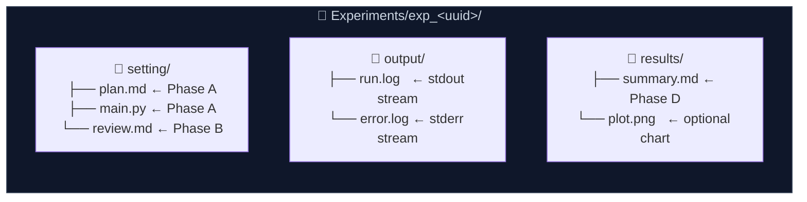

<p align="center">
  
</p>

<h1 align="center">claude-feishu-flow</h1>

<p align="center">
  <strong>The First Autonomous MLOps Agent in your Feishu Workspace.</strong><br/>
  <em>Describe an experiment in plain language. Watch it code, review, run, and report — all by itself.</em>
</p>

<p align="center">
  <a href="https://github.com/turturturturtur/AutoMyFeishu/stargazers"></a>
  <a href="https://github.com/turturturturtur/AutoMyFeishu/network/members"></a>
  <a href="https://github.com/turturturturtur/AutoMyFeishu/issues"></a>
  <a href="https://github.com/turturturturtur/AutoMyFeishu/pulls"></a>
</p>

<p align="center">
  
  
  
  
  
</p>

---

## See it in action

> Send one message in Feishu. Get a fully executed, reviewed, and documented experiment back.

<p align="center">
  
</p>

---

## Why claude-feishu-flow?

Most AI coding tools stop at generating code. **claude-feishu-flow goes further**: it is a fully autonomous multi-agent pipeline that lives inside your Feishu workspace. You describe what you want; the system plans, writes, audits, executes, self-heals on failure, and delivers a polished report — without you ever touching a terminal.

---

## ✨ Core Features

| | Feature | What it means |
|---|---|---|
| 🤖 | **Multi-Agent Orchestration** | Separate agents for generation, code review, execution monitoring, and reporting. Each agent is specialized and independently replaceable. |
| 🔁 | **Self-Healing Execution** | On script failure, the AI reads `stderr`, diagnoses the bug, patches `main.py`, and retries — up to N times. No human intervention needed. |
| 👁️ | **Native Vision & File Parsing** | Attach PDFs, images, or data files directly in Feishu. The agent parses and incorporates them into the experiment context. |
| 📡 | **Real-Time Sub Agent Sessions** | Click "Enter Session" on any experiment card. Chat with the running process: query live logs, tweak hyperparameters, restart — all in-conversation. |
| 🔀 | **Dual-Model Backend** | Switch between **Claude** (Anthropic) and **Kimi** (Moonshot AI) with a single env var. Proxy/mirror endpoints fully supported. |
| 📊 | **Feishu-Native Reporting** | Results auto-written to Bitable (multi-dimensional tables) and pushed as rich message cards — no dashboards to maintain. |

---

## Architecture

### End-to-End Workflow


### Experiment Output Layout



---

## Quick Start

### Prerequisites

- Python 3.10+
- A Feishu self-built app ([create one here](https://open.feishu.cn/app))
- An Anthropic or Kimi API key

### 1 — Install

```bash
git clone https://github.com/turturturturtur/AutoMyFeishu.git
cd claude-feishu-flow
pip install -e .
```

### 2 — Configure

```bash
cp .env.example .env
# Fill in your Feishu credentials and LLM API key
```

### 3 — Wire up Feishu

1. In your Feishu app console, enable the **Bot** capability
2. Set the event subscription URL: `http://your-server:8080/webhook/event`
3. Subscribe to event: `im.message.receive_v1`
4. Copy the **Verification Token** (and optionally the **Encrypt Key**) into `.env`

### 4 — Launch

```bash
bash launch.sh
# or directly:
uvicorn claude_feishu_flow.server.app:create_app_from_env --factory --host 0.0.0.0 --port 8080
```

That's it. Send a message to your bot in Feishu.

### Embed in your own project

```python
from claude_feishu_flow import Bot, Config

bot = Bot(Config())  # loads from .env
bot.run()            # starts uvicorn
```

---

## Commands

| Command | Description |
|---|---|
| `<natural language>` | Describe any task — agent generates, reviews, executes, and reports |
| `<task> --retry N` | Same as above, with up to N self-healing retries on failure |
| `/list` | List all experiments with status |
| `/review exp_<uuid>` | Static code audit (no execution) |
| `/edit exp_<uuid> <instruction>` | Enter interactive multi-turn edit mode |
| `/edit exp_<uuid> <instruction> --retry N` | Edit + re-execute with self-healing |
| `/alias exp_<uuid> <name>` | Assign a human-readable alias to an experiment |
| `/write <topic> [exp_<uuid>]` | Draft a technical document or experiment report |
| `/cancel` | Exit current edit session |
| `/exit` | Leave Sub Agent monitoring mode |
| `/help` | Show the command reference card in Feishu |

---

## Configuration

<details>
<summary><b>Click to expand — Full environment variable reference</b></summary>

Copy `.env.example` to `.env` and fill in the values:

| Variable | Required | Description | Default |
|---|---|---|---|
| `FEISHU_APP_ID` | ✅ | Feishu App ID | — |
| `FEISHU_APP_SECRET` | ✅ | Feishu App Secret | — |
| `FEISHU_VERIFICATION_TOKEN` | ✅ | Webhook verification token | — |
| `FEISHU_ENCRYPT_KEY` | — | Webhook encryption key (if enabled) | `""` |
| `BITABLE_APP_TOKEN` | ✅ | Bitable App Token for results storage | — |
| `BITABLE_TABLE_ID` | — | Table ID (auto-discovered if blank) | `""` |
| `LLM_PROVIDER` | — | `anthropic` or `kimi` | `anthropic` |
| `ANTHROPIC_API_KEY` | ✅* | Claude API key | — |
| `ANTHROPIC_MODEL` | — | Claude model name | `claude-3-5-sonnet-latest` |
| `ANTHROPIC_BASE_URL` | — | API proxy/mirror URL | official endpoint |
| `KIMI_API_KEY` | ✅* | Kimi API key | — |
| `KIMI_MODEL` | — | Kimi model name | `moonshot-v1-32k` |
| `KIMI_BASE_URL` | — | Kimi endpoint | `https://api.moonshot.cn/v1` |
| `HOST` | — | Server bind address | `0.0.0.0` |
| `PORT` | — | Server port | `8080` |
| `EXPERIMENTS_DIR` | — | Root directory for experiments | `./Experiments` |
| `DEFAULT_MAX_RETRIES` | — | Default self-healing retry count | `5` |

\* Required for the selected `LLM_PROVIDER`.

</details>

---

## Project Structure

```
claude_feishu_flow/
├── config.py          # Config loader (pydantic-settings + .env)
├── bot.py             # Public facade: Bot(config).run()
├── feishu/            # Feishu API: auth, messaging cards, Bitable, webhook
├── ai/                # LLM layer: Claude + Kimi agentic loops, tool use
├── runner/            # Executor: subprocess + real-time log streaming
└── server/            # FastAPI routes, Services container, APScheduler
```

---

## Roadmap

- [x] Four-phase autonomous pipeline (Generate → Review → Execute → Report)
- [x] Self-healing retry loop with AI-driven bug fixing
- [x] Sub Agent real-time monitoring sessions
- [x] Dual-model support (Claude + Kimi)
- [x] Vision & file attachment parsing (PDF, images)
- [ ] **Docker sandbox** — isolate script execution in containers
- [ ] **Persistent sessions** — Redis-backed edit/sub-agent session storage
- [ ] **More models** — Gemini, DeepSeek, any OpenAI-compatible endpoint
- [ ] **Web UI** — browser-based experiment dashboard and log viewer

---

## Contributing

Contributions are welcome! Please make sure:
- New features come with tests
- All functions have complete Python type hints
- No credentials are hardcoded (use `svc.config` to read them)

```bash
pip install -e ".[dev]"
pytest
```

---

## Star History

<p align="center">
  <a href="https://star-history.com/#turturturturtur/AutoMyFeishu&Date">
    
  </a>
</p>

---

<p align="center">
  Made with ❤️ · MIT License · <a href="https://open.feishu.cn/app">Get your Feishu App credentials</a>
</p>
