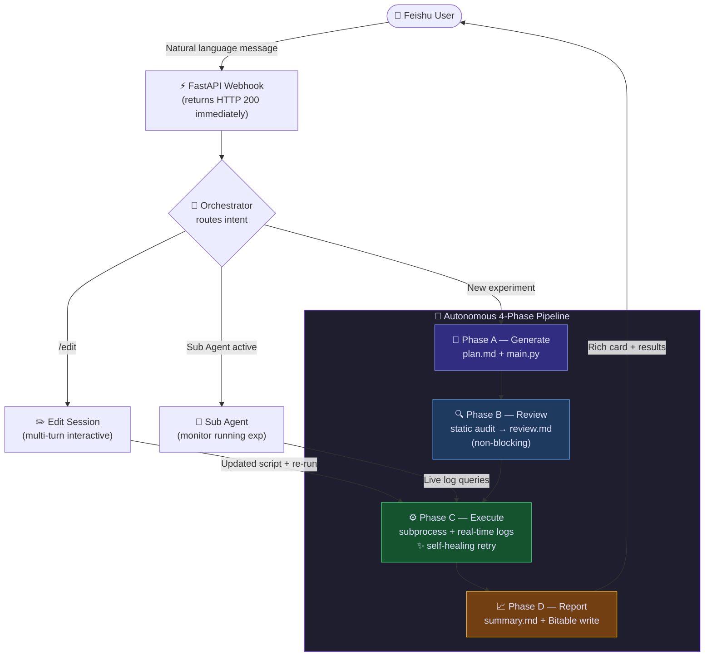
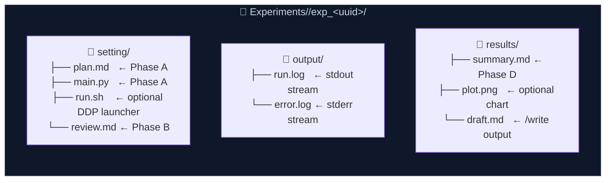

<p align="center">
  
</p>

<h1 align="center">AutoMyFeishu</h1>

<p align="center">
  <strong>The First Autonomous MLOps Agent in your Feishu Workspace.</strong><br/>
  <em>Describe an experiment in plain language. Watch it plan, write, review, execute, self-heal, and report — all by itself.</em>
</p>

<p align="center">
  <a href="https://github.com/turturturturtur/AutoMyFeishu/stargazers"></a>
  <a href="https://github.com/turturturturtur/AutoMyFeishu/network/members"></a>
  <a href="https://github.com/turturturturtur/AutoMyFeishu/issues"></a>
  <a href="https://github.com/turturturturtur/AutoMyFeishu/pulls"></a>
</p>

<p align="center">
  
  
  
  
  
  
</p>

---

## Table of Contents

- [See it in action](#see-it-in-action)
- [Why AutoMyFeishu?](#why-automyfeishu)
- [Core Features](#-core-features)
- [Architecture](#architecture)
- [Quick Start](#quick-start)
- [Commands](#commands)
- [Web Dashboard](#web-dashboard)
- [Configuration](#configuration)
- [Project Structure](#project-structure)
- [Roadmap](#roadmap)
- [Contributing](#contributing)

---

## See it in action

> Send one message in Feishu. Get a fully executed, reviewed, and documented experiment back.

<p align="center">
  
</p>

---

## Why AutoMyFeishu?

Most AI coding tools stop at generating code. **AutoMyFeishu goes further**: it is a fully autonomous multi-agent pipeline that lives inside your Feishu workspace. You describe what you want; the system plans, writes, audits, executes, self-heals on failure, and delivers a polished report — without you ever touching a terminal.

It is designed for ML researchers and engineers who want a zero-friction ChatOps loop: describe your experiment in Chinese or English, attach a paper PDF or architecture diagram, and watch it run.

---

## ✨ Core Features

### 🤖 Orchestrator Multi-Agent Architecture

Three specialized agents, each with a focused role:

- **Main Agent (Orchestrator)** — understands free-form instructions and routes intent to the right pipeline. Handles small talk, tool invocation, and session management.
- **Sub Agent (Experiment Monitor)** — activated when you click "Enter Session" on a finished experiment card. Reads live logs, answers questions about the running process, and can patch code and restart without leaving the chat.
- **Review Agent (Static Auditor)** — automatically audits every generated script for syntax errors, missing imports, OOM risks, and logic flaws before execution. Calls `save_script` to self-correct and writes `review.md`. Non-blocking: the pipeline continues even if review fails.

All three agents are independently swappable and share the same tool-use interface.

### 🧠 Dual-Model Engine

One environment variable (`LLM_PROVIDER`) switches the entire system between two backends:

| Provider | Models | Strength |
|---|---|---|
| `anthropic` (default) | `claude-3-5-sonnet-latest` + any Claude model | Best reasoning & code generation |
| `kimi` | `moonshot-v1-32k` / `moonshot-v1-128k` | 128k context window for long papers |

Both backends share the same agentic loop and tool schemas. Custom proxy/mirror base URLs are fully supported via `ANTHROPIC_BASE_URL` / `KIMI_BASE_URL`.

### 💻 Zero-Build Web Dashboard

A Vue 3 + Tailwind CSS single-page app served directly by FastAPI at `http://your-server:8080/`. No separate build step, no Node.js required in production.

**What's in the dashboard:**
- Experiment list with live status (Running / Done / Failed)
- Real-time log streaming (stdout + stderr, auto-scroll)
- Sub Agent conversation history replay
- Token usage analytics (input / output counts per session)
- Runtime configuration editor

### 📄 Multimodal & Paper-to-Code

Attach files directly in Feishu — the agent reads them before generating code:

| File type | How it's handled |
|---|---|
| `.pdf` | Extracted to text via PyMuPDF and appended to the instruction |
| `.jpg` / `.png` | Encoded as base64 and sent to Claude Vision |
| `.md`, `.py`, `.json`, `.csv`, `.yaml`, … | UTF-8 decoded and appended verbatim |

Send a paper, a diagram, or a data schema. The agent incorporates it into the experiment context automatically.

### 🏢 Enterprise Multi-Tenant Isolation

Built for shared GPU servers with multiple researchers:

- **Group-chat @-mention filter** — only responds when @-mentioned; ignores background noise from other bots.
- **Per-user data sandbox** — each user's experiments live under `Experiments/<open_id>/`, isolated from everyone else's work.
- **Per-user GLOBAL_RULES** — place a `GLOBAL_RULES.md` in the working directory to inject lab-wide constraints (GPU count, conda policy, data paths) into every agent's system prompt.

### 🔄 Fully Autonomous Self-Healing Executor

The execution layer does more than run a script:

- **`--retry N` self-healing loop** — on non-zero exit: reads `stderr`, asks Claude to diagnose and patch `main.py`, then restarts automatically. Repeats up to N times.
- **`run.sh` support** — if the experiment directory contains a `run.sh`, the executor runs it instead of `main.py`. Use this for `torchrun` / DDP multi-GPU launches.
- **Process lifecycle management** — starting a new run for an existing experiment kills the previous process first, preventing runaway GPU processes.
- **Real-time log streaming** — `output/run.log` and `output/error.log` written line-by-line so you can tail them or watch them live in the dashboard.

---

## Architecture

### End-to-End Workflow



### Experiment Output Layout



---

## Quick Start

### Prerequisites

- Python 3.10+
- A Feishu self-built app ([create one here](https://open.feishu.cn/app))
- An Anthropic or Kimi API key

### 1 — Install

```bash
git clone https://github.com/turturturturtur/AutoMyFeishu.git
cd AutoMyFeishu
pip install -e .
```

### 2 — Configure

```bash
cp .env.example .env
# Fill in your Feishu credentials and LLM API key
```

### 3 — Wire up Feishu

1. In your Feishu app console, enable the **Bot** capability
2. Set the event subscription URL: `http://your-server:8080/webhook/event`
3. Subscribe to event: `im.message.receive_v1`
4. Copy the **Verification Token** (and optionally the **Encrypt Key**) into `.env`

### 4 — Launch

```bash
bash launch.sh
# or directly:
uvicorn claude_feishu_flow.server.app:create_app_from_env --factory --host 0.0.0.0 --port 8080
```

That's it. Send a message to your bot in Feishu. Open `http://your-server:8080/` for the dashboard.

### Embed in your own project

```python
from claude_feishu_flow import Bot, Config

bot = Bot(Config())  # loads from .env
bot.run()            # starts uvicorn
```

---

## Commands

| Command | Description |
|---|---|
| `<natural language>` | Describe any task — agent generates, reviews, executes, and reports |
| `<task> --retry N` | Same as above, with up to N self-healing retries on failure |
| `/list` | List all experiments with status and aliases |
| `/review exp_<uuid>` | Static code audit only (no execution) |
| `/edit exp_<uuid> <instruction>` | Enter interactive multi-turn edit mode |
| `/edit exp_<uuid> <instruction> --retry N` | Edit + re-execute with self-healing |
| `/alias exp_<uuid> <name>` | Assign a human-readable alias to an experiment |
| `/write <topic> [exp_<uuid>]` | Draft a technical document or experiment report |
| `/cancel` | Exit current edit session |
| `/exit` | Leave Sub Agent monitoring mode |
| `/help` | Show the command reference card in Feishu |

The Orchestrator also understands tool-driven intents without explicit commands:

- `"画出 exp_xxx 的 loss 曲线"` → generates a matplotlib chart, uploads it to Feishu
- `"每天早上9点汇报实验进展"` → creates a cron job that messages you daily
- `"显卡状态如何？"` → runs `nvidia-smi` and replies inline

---

## Web Dashboard

The dashboard is served at `http://your-server:8080/` alongside the webhook endpoint — no separate deployment needed.

**Features:**

- **Experiment list** — all runs with status badge (Running / Done / Failed / Pending), creation time, and owner
- **Real-time log viewer** — tail `run.log` and `error.log` with auto-scroll; backed by a streaming REST endpoint
- **Sub Agent history** — replay the full multi-turn conversation for any Sub Agent session
- **Token usage** — cumulative input/output token counts across all API calls
- **Config editor** — update runtime settings without restarting the server

**REST API** (also usable directly):

| Endpoint | Description |
|---|---|
| `GET /api/experiments` | List all experiments with metadata |
| `GET /api/experiments/{task_id}/logs` | Fetch log tail (run.log + error.log) |
| `GET /api/experiments/{task_id}/logs/live` | WebSocket real-time log stream |
| `GET /api/sub-agent/{task_id}/history` | Sub Agent conversation history |
| `GET /api/settings` | Current configuration |
| `POST /api/settings` | Update configuration |

---

## Configuration

<details>
<summary><b>Click to expand — Full environment variable reference</b></summary>

Copy `.env.example` to `.env` and fill in the values:

| Variable | Required | Description | Default |
|---|---|---|---|
| `FEISHU_APP_ID` | ✅ | Feishu App ID (`cli_...`) | — |
| `FEISHU_APP_SECRET` | ✅ | Feishu App Secret | — |
| `FEISHU_VERIFICATION_TOKEN` | ✅ | Webhook verification token | — |
| `FEISHU_ENCRYPT_KEY` | — | Webhook encryption key (if enabled) | `""` |
| `FEISHU_BOT_OPEN_ID` | — | Bot's own `open_id` for @-mention validation in group chats | `""` |
| `FEISHU_BOT_NAME` | — | Bot display name for @-mention detection (fallback when `OPEN_ID` not set) | `AutoMyFeishu` |
| `BITABLE_APP_TOKEN` | ✅ | Bitable App Token for results storage | — |
| `BITABLE_TABLE_ID` | — | Table ID (auto-discovered if blank) | `""` |
| `LLM_PROVIDER` | — | `anthropic` or `kimi` | `anthropic` |
| `ANTHROPIC_API_KEY` | ✅* | Claude API key | — |
| `ANTHROPIC_MODEL` | — | Claude model name | `claude-3-5-sonnet-latest` |
| `ANTHROPIC_BASE_URL` | — | API proxy/mirror URL | official endpoint |
| `KIMI_API_KEY` | ✅* | Kimi API key | — |
| `KIMI_MODEL` | — | Kimi model name | `moonshot-v1-32k` |
| `KIMI_BASE_URL` | — | Kimi endpoint | `https://api.kimi.com/coding/v1` |
| `HOST` | — | Server bind address | `0.0.0.0` |
| `PORT` | — | Server port | `8080` |
| `EXPERIMENTS_DIR` | — | Root directory for experiments | `./Experiments` |
| `DEFAULT_MAX_RETRIES` | — | Default self-healing retry count | `5` |

\* Required for the selected `LLM_PROVIDER`.

</details>

---

## Project Structure

```
claude_feishu_flow/
├── config.py              # Config loader (pydantic-settings + .env)
├── bot.py                 # Public facade: Bot(config).run()
├── feishu/
│   ├── auth.py            # Token manager + 2-hour refresh loop
│   ├── client.py          # HTTP client wrapper
│   ├── bitable.py         # Bitable read/write
│   ├── messaging.py       # Rich card builders (experiment, document, help, list)
│   └── webhook.py         # Event parsing + AES-256 decryption
├── ai/
│   ├── client.py          # Claude agentic loop + tool dispatch
│   ├── kimi_client.py     # Kimi/Moonshot client (OpenAI-compatible)
│   ├── tools.py           # Tool schemas and handlers
│   ├── prompt.py          # System prompts per agent role
│   └── token_tracker.py   # Usage analytics
├── runner/
│   └── executor.py        # Async subprocess executor with lifecycle management
└── server/
    ├── app.py             # FastAPI factory + lifespan + Services container
    ├── routes.py          # Webhook handler + 4-phase pipeline
    ├── scheduler.py       # APScheduler wrapper + cron persistence
    ├── web.py             # REST API + dashboard endpoints
    ├── static/            # Vue 3 + Tailwind compiled assets
    └── templates/         # index.html SPA shell
```

---

## Roadmap

- [x] Four-phase autonomous pipeline (Generate → Review → Execute → Report)
- [x] Self-healing retry loop with AI-driven bug fixing
- [x] Sub Agent real-time monitoring sessions
- [x] Dual-model support (Claude + Kimi/Moonshot)
- [x] Vision & file attachment parsing (PDF, images, text files)
- [x] Built-in Vue 3 web dashboard with real-time log streaming
- [x] APScheduler cron jobs with persistence across restarts
- [x] Enterprise multi-tenant isolation (per-user experiment sandboxes)
- [x] Group-chat @-mention filter
- [ ] **Docker sandbox** — isolate script execution in containers
- [ ] **Persistent sessions** — Redis-backed edit/sub-agent session storage
- [ ] **More models** — Gemini, DeepSeek, any OpenAI-compatible endpoint

---

## Contributing

Contributions are welcome! Please make sure:

- New features come with tests
- All functions have complete Python type hints
- No credentials are hardcoded (use `svc.config` to read them)

```bash
pip install -e ".[dev]"
pytest
```

---

## Star History

<p align="center">
  <a href="https://star-history.com/#turturturturtur/AutoMyFeishu&Date">
    
  </a>
</p>

---

<p align="center">
  Made with ❤️ · MIT License · <a href="https://open.feishu.cn/app">Get your Feishu App credentials</a>
</p>
