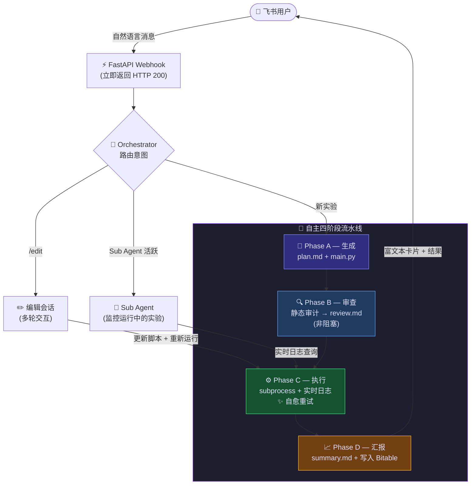
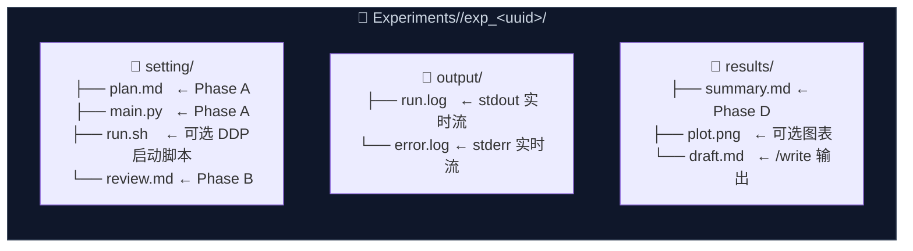

<p align="center">
  
</p>

<h1 align="center">AutoMyFeishu</h1>

<p align="center">
  <strong>飞书工作区中第一个完全自主的 MLOps 智能体。</strong><br/>
  <em>用自然语言描述实验，剩下的交给它：规划、编写、审查、执行、自愈、汇报——全程无需你动手。</em>
</p>

<p align="center">
  <a href="https://github.com/turturturturtur/AutoMyFeishu/stargazers"></a>
  <a href="https://github.com/turturturturtur/AutoMyFeishu/network/members"></a>
  <a href="https://github.com/turturturturtur/AutoMyFeishu/issues"></a>
  <a href="https://github.com/turturturturtur/AutoMyFeishu/pulls"></a>
</p>

<p align="center">
  
  
  
  
  
  
</p>

**中文版 | [English](README.md)**

---

## 目录

- [效果演示](#效果演示)
- [为什么选择 AutoMyFeishu？](#为什么选择-automyfeishu)
- [核心特性](#-核心特性)
- [架构设计](#架构设计)
- [快速开始](#快速开始)
- [命令参考](#命令参考)
- [Web 控制台](#web-控制台)
- [配置说明](#配置说明)
- [项目结构](#项目结构)
- [生产环境部署 (Linux 服务)](#生产环境部署-linux-服务)
- [开发路线图](#开发路线图)
- [参与贡献](#参与贡献)

---

## 效果演示

> 在飞书发送一条消息，收到一份完整执行、经过审查并附带报告的实验结果。

<p align="center">
  
</p>

---

## 为什么选择 AutoMyFeishu？

大多数 AI 编程工具止步于生成代码。**AutoMyFeishu 走得更远**：它是一个完全自主的多智能体流水线，直接运行在你的飞书工作区中。你只需描述需求，系统会自动完成规划、编写、审查、执行、自愈修复，并输出一份完整报告——你甚至不需要打开终端。

专为 ML 研究员和工程师设计，提供零摩擦的 ChatOps 循环：用中文或英文描述你的实验，附上论文 PDF 或架构图，然后坐等结果。

---

## ✨ 核心特性

### 🤖 Orchestrator 多智能体架构

三个专职智能体，各司其职：

- **主智能体（Orchestrator）** — 理解自由格式的指令，将意图路由到对应的执行流水线，同时负责闲聊、工具调用和会话管理。
- **Sub Agent（实验监控）** — 在实验卡片上点击「进入会话」后激活。实时读取日志、回答关于运行进程的问题，并可在不离开聊天界面的情况下修改代码并重启。
- **Review Agent（静态审查）** — 在每次执行前自动审查生成的脚本，检查语法错误、缺失导入、OOM 风险和逻辑缺陷。调用 `save_script` 自动修复并写入 `review.md`。非阻塞：即使审查失败，流水线仍会继续。

三个智能体相互独立、可单独替换，共享同一套 tool-use 接口。

### 🧠 双模型引擎双驱

一个环境变量（`LLM_PROVIDER`）即可切换整个系统的后端：

| 服务商 | 模型 | 优势 |
|---|---|---|
| `anthropic`（默认） | `claude-3-5-sonnet-latest` 及任意 Claude 模型 | 最强推理与代码生成能力 |
| `kimi` | `moonshot-v1-32k` / `moonshot-v1-128k` | 128k 超长上下文，适合长篇论文 |

两个后端共享同一套 Agentic 循环和 Tool Schema。通过 `ANTHROPIC_BASE_URL` / `KIMI_BASE_URL` 完整支持代理/镜像端点。

### 💻 零构建 Web 控制台

基于 Vue 3 + Tailwind CSS 构建的单页应用，由 FastAPI 直接在 `http://your-server:8080/` 提供服务。生产环境无需 Node.js，无需单独构建。

**控制台功能：**
- 实验列表，实时显示运行状态（运行中 / 已完成 / 失败）
- 实时日志流（stdout + stderr，自动滚动）
- Sub Agent 多轮对话历史回放
- Token 用量统计（每次会话的输入/输出数）
- 运行时配置编辑器（无需重启服务器）

### 📄 多模态与论文一键复现

直接在飞书发送附件，智能体会在生成代码前读取内容：

| 文件类型 | 处理方式 |
|---|---|
| `.pdf` | 通过 PyMuPDF 提取文本，追加到指令中 |
| `.jpg` / `.png` | Base64 编码后发送给 Claude Vision |
| `.md`、`.py`、`.json`、`.csv`、`.yaml`…… | UTF-8 解码后原文追加 |

发一篇论文、一张架构图或一份数据 Schema，智能体会自动将其纳入实验上下文。

### 🏢 企业级多租户隔离

专为多人共用 GPU 服务器的团队设计：

- **群聊 @ 过滤** — 仅在被 @ 时响应，屏蔽群内其他机器人的噪音。
- **用户级数据沙盒** — 每位用户的实验存储在独立的 `Experiments/<open_id>/` 目录下，互不干扰。
- **用户级 GLOBAL_RULES** — 在工作目录放置 `GLOBAL_RULES.md`，向所有智能体的系统提示词注入实验室约束（GPU 数量、conda 规范、数据路径等）。

### 🔄 全自动自愈执行器

执行层远不止运行脚本：

- **`--retry N` 自愈循环** — 脚本非零退出时：读取 `stderr`，让 Claude 诊断并修复 `main.py`，然后自动重启。最多重试 N 次。
- **`run.sh` 支持** — 若实验目录中存在 `run.sh`，执行器会运行它而非 `main.py`，适用于 `torchrun` / DDP 分布式训练启动。
- **进程生命周期管理** — 对同一实验启动新一轮运行时，会先终止旧进程，防止 GPU 进程失控。
- **实时日志流** — `output/run.log` 和 `output/error.log` 逐行写入，支持 `tail` 跟踪或在控制台实时查看。

---

## 架构设计

### 端到端工作流



### 实验输出目录结构



---

## 快速开始

### 前置条件

- Python 3.10+
- 一个飞书自建应用（[点此创建](https://open.feishu.cn/app)）
- Anthropic 或 Kimi API Key

### 第一步 — 安装

```bash
git clone https://github.com/turturturturtur/AutoMyFeishu.git
cd AutoMyFeishu
pip install -e .
```

### 第二步 — 配置

```bash
cp .env.example .env
# 填入飞书凭证和 LLM API Key
```

### 第三步 — 接入飞书

1. 在飞书应用后台开启 **机器人** 能力
2. 将事件订阅 URL 设置为：`http://your-server:8080/webhook/event`
3. 订阅事件：`im.message.receive_v1`
4. 将 **Verification Token**（以及可选的 **Encrypt Key**）填入 `.env`

### 第四步 — 启动

```bash
bash launch.sh
# 或直接运行：
uvicorn claude_feishu_flow.server.app:create_app_from_env --factory --host 0.0.0.0 --port 8080
```

完成！在飞书向机器人发送一条消息，打开 `http://your-server:8080/` 查看控制台。

### 嵌入到你的项目

```python
from claude_feishu_flow import Bot, Config

bot = Bot(Config())  # 从 .env 加载配置
bot.run()            # 启动 uvicorn
```

---

## 命令参考

| 命令 | 说明 |
|---|---|
| `<自然语言>` | 描述任意任务——智能体自动生成、审查、执行并汇报 |
| `<任务描述> --retry N` | 同上，最多允许 N 次自愈重试 |
| `/list` | 列出所有实验及状态、别名 |
| `/review exp_<uuid>` | 仅静态代码审查（不执行） |
| `/edit exp_<uuid> <指令>` | 进入多轮交互编辑模式 |
| `/edit exp_<uuid> <指令> --retry N` | 编辑 + 重新执行（含自愈） |
| `/alias exp_<uuid> <名称>` | 为实验设置易读别名 |
| `/write <主题> [exp_<uuid>]` | 撰写技术文档或实验报告 |
| `/cancel` | 退出当前编辑会话 |
| `/exit` | 退出 Sub Agent 监控模式 |
| `/help` | 在飞书显示命令参考卡片 |

Orchestrator 也能理解不带显式命令的自然语言意图：

- `"画出 exp_xxx 的 loss 曲线"` → 生成 matplotlib 图表并上传至飞书
- `"每天早上9点汇报实验进展"` → 创建定时任务，每日主动推送消息
- `"显卡状态如何？"` → 运行 `nvidia-smi` 并直接回复

---

## Web 控制台

控制台与 Webhook 端点共用同一端口，访问 `http://your-server:8080/` 即可——无需单独部署。

**功能列表：**

- **实验列表** — 所有运行记录，含状态徽章（运行中 / 已完成 / 失败 / 待执行）、创建时间和所属用户
- **实时日志查看器** — 自动滚动的 `run.log` 与 `error.log` 尾部日志，由流式 REST 接口支撑
- **Sub Agent 历史** — 回放任意 Sub Agent 会话的完整多轮对话
- **Token 用量** — 所有 API 调用的累计输入/输出 Token 统计
- **配置编辑器** — 无需重启服务器，在线更新运行时配置

**REST API**（也可直接调用）：

| 接口 | 说明 |
|---|---|
| `GET /api/experiments` | 列出所有实验及元数据 |
| `GET /api/experiments/{task_id}/logs` | 获取日志尾部（run.log + error.log） |
| `GET /api/experiments/{task_id}/logs/live` | WebSocket 实时日志流 |
| `GET /api/sub-agent/{task_id}/history` | Sub Agent 会话历史 |
| `GET /api/settings` | 获取当前配置 |
| `POST /api/settings` | 更新配置 |

---

## 配置说明

<details>
<summary><b>点击展开 — 完整环境变量参考</b></summary>

将 `.env.example` 复制为 `.env` 并填入对应值：

| 变量名 | 必填 | 说明 | 默认值 |
|---|---|---|---|
| `FEISHU_APP_ID` | ✅ | 飞书应用 App ID（`cli_...`） | — |
| `FEISHU_APP_SECRET` | ✅ | 飞书应用 App Secret | — |
| `FEISHU_VERIFICATION_TOKEN` | ✅ | Webhook 验证 Token | — |
| `FEISHU_ENCRYPT_KEY` | — | Webhook 加密密钥（启用加密时必填） | `""` |
| `FEISHU_BOT_OPEN_ID` | — | 机器人自身的 `open_id`，用于群聊 @ 验证 | `""` |
| `FEISHU_BOT_NAME` | — | 机器人在飞书的显示名称（未设置 `OPEN_ID` 时作为备用 @ 检测依据） | `AutoMyFeishu` |
| `BITABLE_APP_TOKEN` | ✅ | 多维表格 App Token，用于存储实验结果 | — |
| `BITABLE_TABLE_ID` | — | 表格 ID（留空则自动发现/创建） | `""` |
| `LLM_PROVIDER` | — | `anthropic` 或 `kimi` | `anthropic` |
| `ANTHROPIC_API_KEY` | ✅* | Claude API Key | — |
| `ANTHROPIC_MODEL` | — | Claude 模型名称 | `claude-3-5-sonnet-latest` |
| `ANTHROPIC_BASE_URL` | — | API 代理/镜像地址 | 官方端点 |
| `KIMI_API_KEY` | ✅* | Kimi API Key | — |
| `KIMI_MODEL` | — | Kimi 模型名称 | `moonshot-v1-32k` |
| `KIMI_BASE_URL` | — | Kimi 端点地址 | `https://api.kimi.com/coding/v1` |
| `HOST` | — | 服务器监听地址 | `0.0.0.0` |
| `PORT` | — | 服务器端口 | `8080` |
| `EXPERIMENTS_DIR` | — | 实验根目录 | `./Experiments` |
| `DEFAULT_MAX_RETRIES` | — | 默认自愈重试次数 | `5` |

\* 根据所选 `LLM_PROVIDER` 必填其一。

</details>

---

## 项目结构

```
claude_feishu_flow/
├── config.py              # 配置加载器（pydantic-settings + .env）
├── bot.py                 # 对外门面：Bot(config).run()
├── feishu/
│   ├── auth.py            # Token 管理器 + 2小时自动刷新
│   ├── client.py          # HTTP 客户端封装
│   ├── bitable.py         # 多维表格读写
│   ├── messaging.py       # 富文本卡片构建（实验卡、文档卡、帮助卡、列表卡）
│   └── webhook.py         # 事件解析 + AES-256 解密
├── ai/
│   ├── client.py          # Claude Agentic 循环 + 工具分发
│   ├── kimi_client.py     # Kimi/Moonshot 客户端（OpenAI 兼容）
│   ├── tools.py           # 工具 Schema 与处理器
│   ├── prompt.py          # 各智能体角色的系统提示词
│   └── token_tracker.py   # 用量统计
├── runner/
│   └── executor.py        # 异步 subprocess 执行器（含进程生命周期管理）
└── server/
    ├── app.py             # FastAPI 工厂 + 生命周期 + Services 容器
    ├── routes.py          # Webhook 处理器 + 四阶段流水线
    ├── scheduler.py       # APScheduler 封装 + 定时任务持久化
    ├── web.py             # REST API + 控制台端点
    ├── static/            # Vue 3 + Tailwind 编译产物
    └── templates/         # index.html SPA 入口
```

---

## 生产环境部署 (Linux 服务)

对于裸金属 Linux 服务器（包括 GPU 工作站），AutoMyFeishu 提供了一键安装脚本和 systemd 服务模板，可将其作为全托管后台守护进程运行，支持崩溃自动重启和开机自启。

### 安装依赖

```bash
git clone https://github.com/turturturturtur/AutoMyFeishu.git
cd AutoMyFeishu
bash install.sh
```

`install.sh` 将自动完成以下操作：

- 检查 Python 3.10+ 是否可用
- 在项目目录下创建 `.venv` 虚拟环境
- 从 `requirements.txt` 安装所有依赖
- 若 `.env` 不存在，自动从 `.env.example` 复制一份

### 填写配置

```bash
nano .env   # 填入 FEISHU_APP_ID、FEISHU_APP_SECRET 以及 LLM API Key
```

### 注册并启动服务

```bash
sudo bash manage.sh install   # 写入 unit 文件，启用开机自启
sudo bash manage.sh start     # 立即启动服务
```

### 服务管理命令

| 命令 | 说明 |
| --- | --- |
| `sudo bash manage.sh start` | 启动服务 |
| `sudo bash manage.sh stop` | 停止服务 |
| `sudo bash manage.sh restart` | 重启服务 |
| `bash manage.sh status` | 查看 systemd 状态 |
| `bash manage.sh log` | 实时追踪日志（Ctrl-C 退出） |
| `sudo bash manage.sh uninstall` | 彻底移除服务 |

日志写入 `logs/service.log`，也可通过以下命令查看：

```bash
journalctl -u claude-feishu-flow -f
```

---

## 开发路线图

- [x] 自主四阶段流水线（生成 → 审查 → 执行 → 汇报）
- [x] AI 驱动的自愈重试循环
- [x] Sub Agent 实时监控会话
- [x] 双模型支持（Claude + Kimi/Moonshot）
- [x] 多模态附件解析（PDF、图片、文本文件）
- [x] 内置 Vue 3 Web 控制台（含实时日志流）
- [x] APScheduler 定时任务（支持重启后恢复）
- [x] 企业级多租户隔离（用户级实验沙盒）
- [x] 群聊 @ 过滤
- [ ] **Docker 沙箱** — 在容器中隔离脚本执行
- [ ] **持久化会话** — 基于 Redis 的编辑/Sub Agent 会话存储
- [ ] **更多模型** — Gemini、DeepSeek、任意 OpenAI 兼容端点

---

## 参与贡献

欢迎贡献代码！请确保：

- 新功能附带测试用例
- 所有函数包含完整的 Python Type Hints
- 不得硬编码凭证（通过 `svc.config` 读取）

```bash
pip install -e ".[dev]"
pytest
```

---

## Star 历史

<p align="center">
  <a href="https://star-history.com/#turturturturtur/AutoMyFeishu&Date">
    
  </a>
</p>

---

<p align="center">
  用 ❤️ 打造 · MIT 许可证 · <a href="https://open.feishu.cn/app">获取飞书应用凭证</a>
</p>
